# Control Flow Analysis

## Overview

This document analyzes the execution flow, decision logic, and control structures in the DangerPrep setup system. The script follows a sophisticated phase-based execution model with comprehensive error handling and resume capabilities.

## Main Execution Flow

### 1. Script Initialization

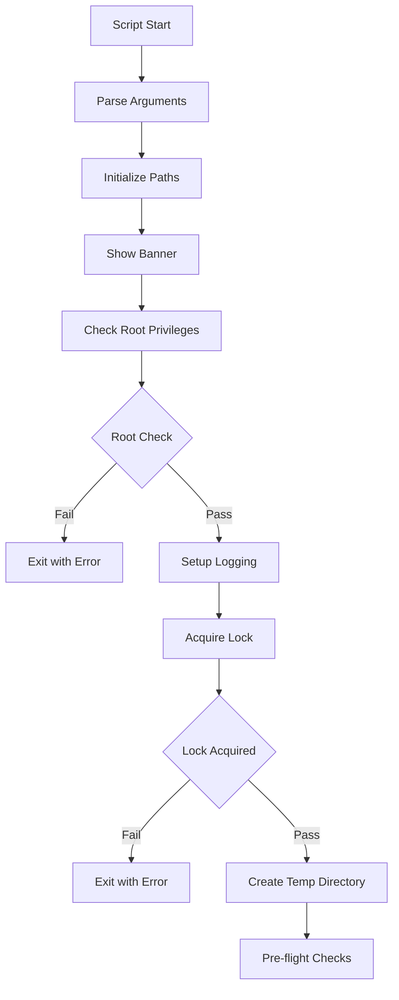

**Key Decision Points**:
- **Root Privilege Check**: Must run as root/sudo
- **Lock Acquisition**: Prevents concurrent execution
- **Network Connectivity**: Required for package downloads

### 2. Configuration Collection Phase

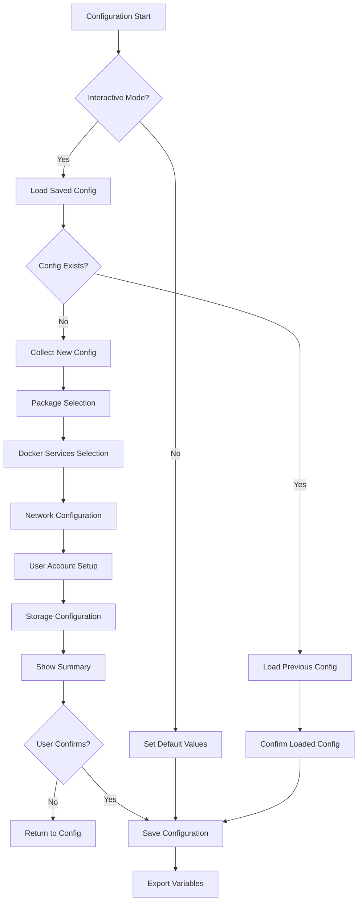

**Configuration Decision Logic**:
- **Non-Interactive Mode**: Use defaults, skip prompts
- **Force Interactive**: Override non-interactive detection
- **Saved Configuration**: Resume with previous choices
- **User Confirmation**: Final approval before proceeding

### 3. Phase-Based Installation System

#### Installation Phases Array
```bash
installation_phases=(
  "backup_original_configs:Backing up original configurations"
  "update_system_packages:Updating system packages"
  "install_essential_packages:Installing essential packages"
  "setup_automatic_updates:Setting up automatic updates"
  "detect_and_configure_nvme_storage:Detecting and configuring NVMe storage"
  "load_motd_config:Loading MOTD configuration"
  "configure_kernel_hardening:Configuring kernel hardening"
  "setup_file_integrity_monitoring:Setting up file integrity monitoring"
  "setup_hardware_monitoring:Setting up hardware monitoring"
  "setup_advanced_security_tools:Setting up advanced security tools"
  "configure_rootless_docker:Configuring rootless Docker"
  "enumerate_docker_services:Enumerating Docker services"
  "setup_docker_services:Setting up Docker services"
  "setup_container_health_monitoring:Setting up container health monitoring"
  "detect_network_interfaces:Detecting network interfaces"
  "setup_raspap:Setting up RaspAP"
  "configure_rk3588_performance:Applying hardware optimizations"
  "generate_sync_configs:Generating sync configurations"
  "setup_tailscale:Setting up Tailscale"
  "setup_advanced_dns:Setting up advanced DNS"
  "setup_certificate_management:Setting up certificate management"
  "install_management_tools:Installing management tools"
  "create_routing_scenarios:Creating routing scenarios"
  "setup_system_monitoring:Setting up system monitoring"
  "configure_nfs_client:Configuring NFS client"
  "install_maintenance_tools:Installing maintenance tools"
  "setup_encrypted_backups:Setting up encrypted backups"
  "configure_user_accounts:Configuring user accounts"
  "configure_screen_lock:Configuring screen lock settings"
  "create_emergency_recovery_service:Creating emergency recovery service"
  "enable_essential_services:Enabling essential system services"
  "start_all_services:Starting all services"
  "verify_setup:Verifying setup"
)
```

#### Phase Execution Logic

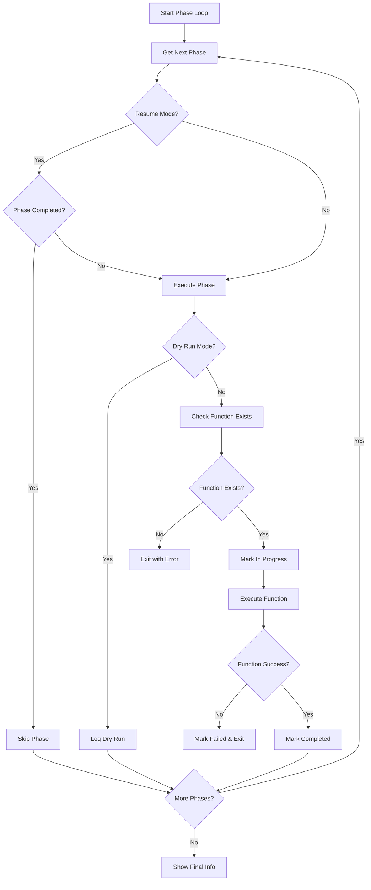

**Phase Control Logic**:
- **Resume Detection**: Check for previous incomplete installation
- **Function Validation**: Ensure function exists before execution
- **State Tracking**: Mark phases as in_progress/completed/failed
- **Hardware Conditional**: Skip RK3588 optimization on non-FriendlyElec

### 4. Error Handling and Recovery

#### Signal Handling
```bash
trap 'handle_error ${LINENO}' ERR
trap cleanup_resources EXIT
trap handle_interrupt INT
trap handle_termination TERM
```

#### Error Handler Flow

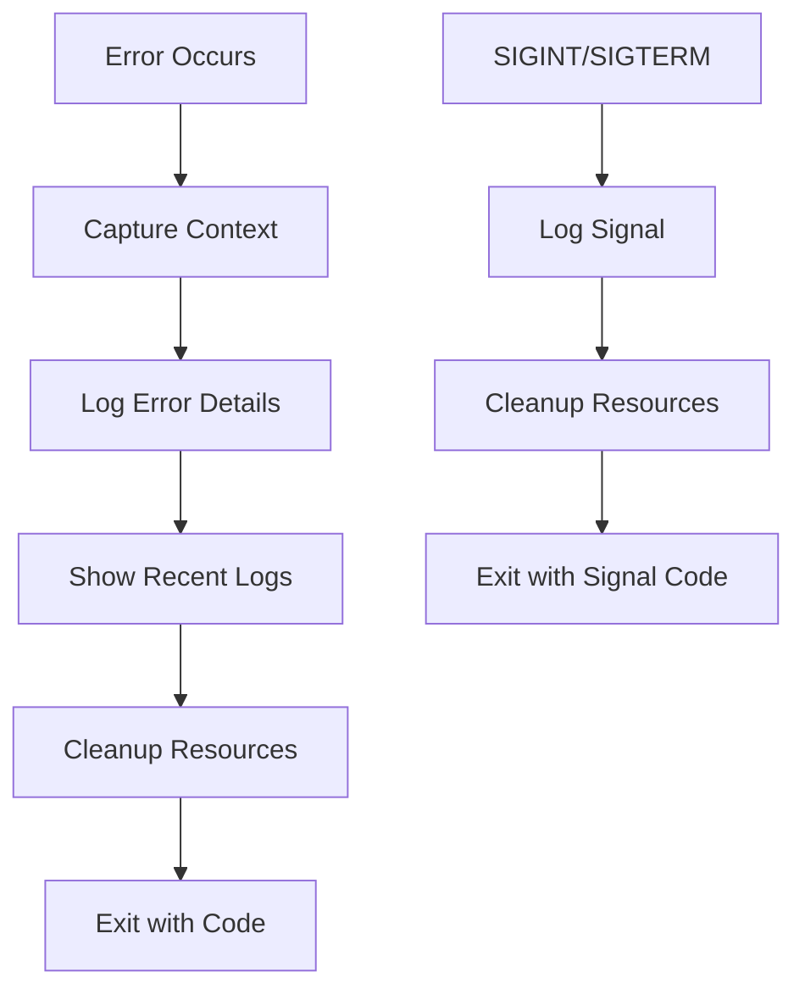

**Error Context Captured**:
- Line number where error occurred
- Failed command (`${BASH_COMMAND}`)
- Function call stack (`${FUNCNAME[*]}`)
- Current working directory
- Current user and UID
- Last 5 log entries for context

#### Cleanup System

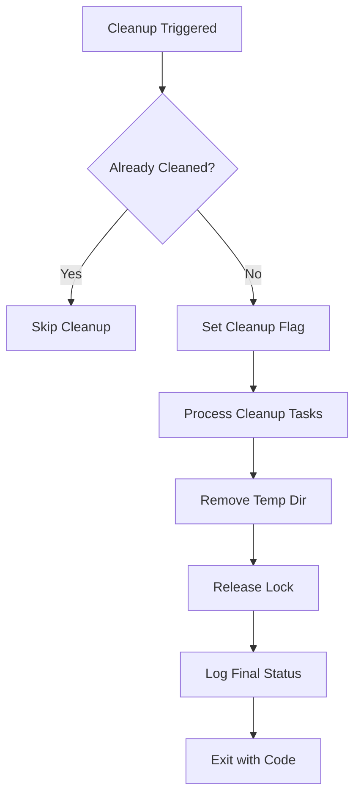

### 5. Package Installation Control Flow

#### Package Selection Logic

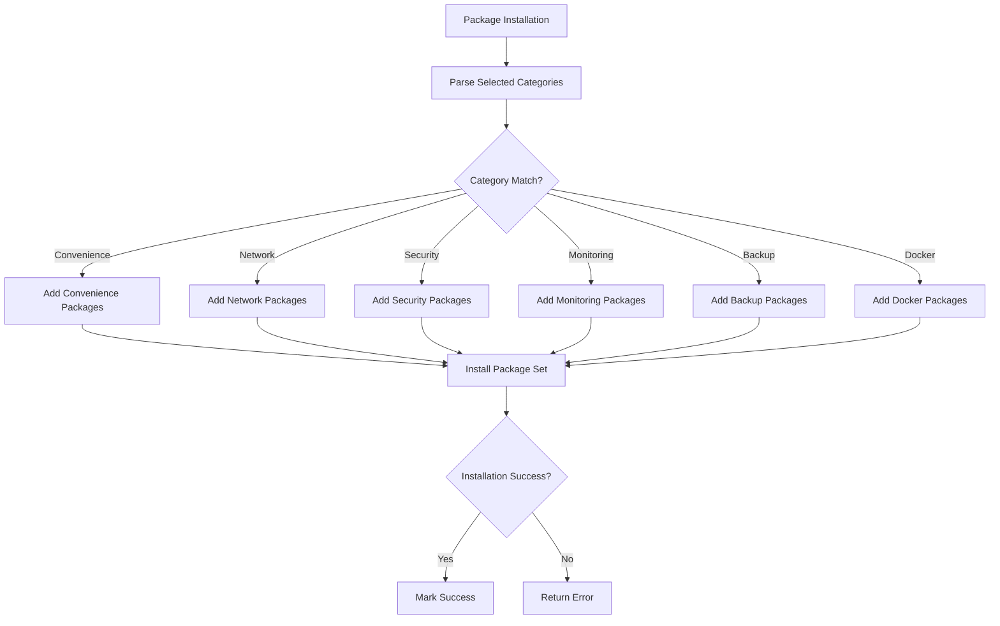

#### FriendlyElec Hardware Detection

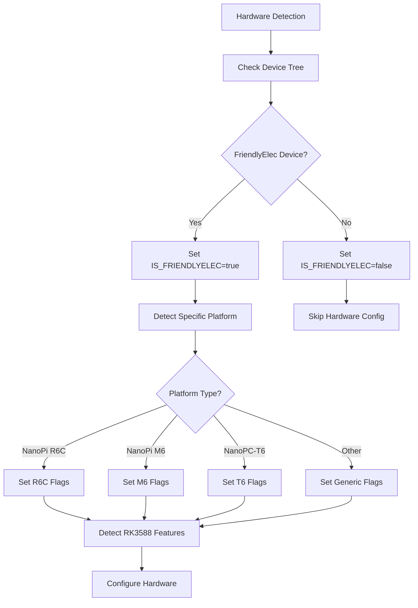

### 6. Docker Service Deployment Flow

#### Service Selection and Deployment

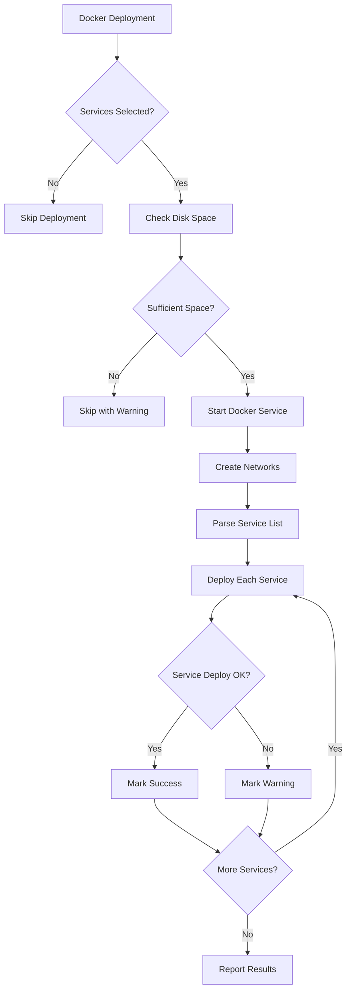

### 7. User Account Management Flow

#### User Account Configuration

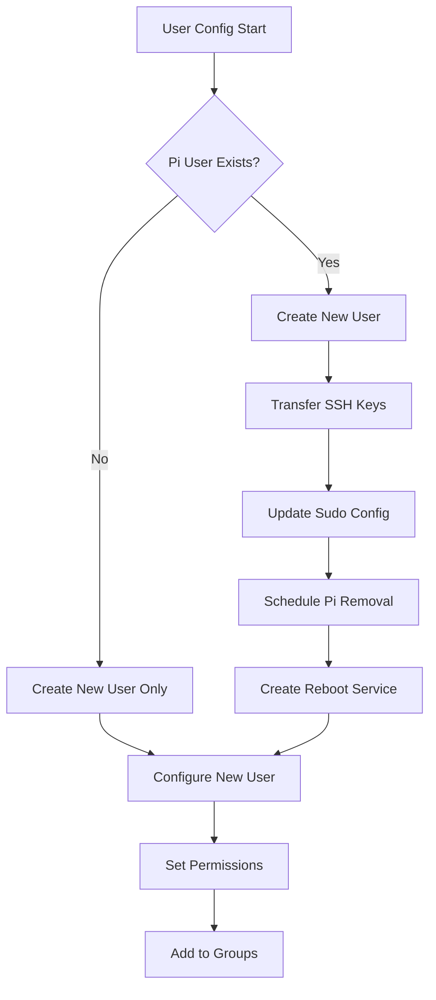

#### Pi User Removal (Deferred via Service)

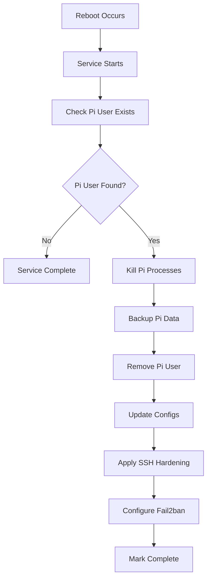

### 8. Conditional Execution Patterns

#### Hardware-Specific Execution
```bash
# RK3588 Performance Optimization
if [[ "$phase_function" == "configure_rk3588_performance" && "$IS_FRIENDLYELEC" != "true" ]]; then
  log_info "Skipping RK3588 optimizations (not FriendlyElec hardware)"
  continue
fi

# FriendlyElec Package Installation
if [[ "$IS_FRIENDLYELEC" == true ]] && [[ -n "$FRIENDLYELEC_INSTALL_PACKAGES" ]]; then
  # Install hardware-specific packages
fi
```

#### Package Category Conditional Installation
```bash
# Network Packages
if [[ -n "${SELECTED_PACKAGE_CATEGORIES:-}" ]] && echo "${SELECTED_PACKAGE_CATEGORIES:-}" | grep -q "Network packages"; then
  package_categories+=("Network:netplan.io,iproute2,wondershaper,iperf3,tailscale")
fi
```

#### Service Availability Checks
```bash
# Docker Service Check
if ! command -v docker >/dev/null 2>&1; then
  enhanced_status_indicator "warning" "Docker command not found - skipping Docker network setup"
  return 0
fi
```

### 9. Resume and Recovery Logic

#### Installation Resume

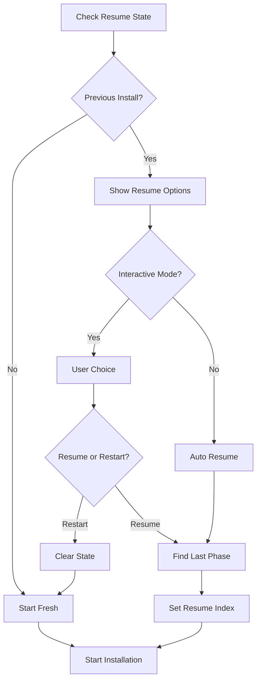

#### State Persistence
- **Phase Tracking**: Each phase marked as in_progress/completed/failed
- **Resume Capability**: Can resume from any completed phase
- **State Validation**: Verify state consistency before resume
- **Cleanup on Success**: Clear state after successful completion

---

*This control flow analysis documents the complete execution logic, decision points, and control structures in the setup script. The phase-based architecture with comprehensive error handling and resume capabilities demonstrates enterprise-grade installation system design.*
